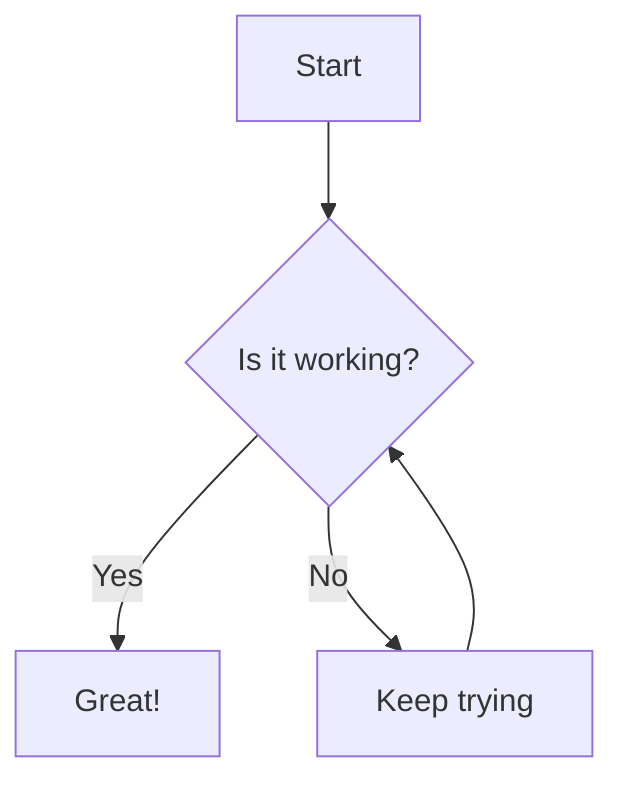

# Mermaid Diagram Sample

This project contains a sample Mermaid diagram.

## Sample Diagram

## How to view
You can view this diagram in GitHub, GitLab, or any Markdown editor that supports Mermaid.
